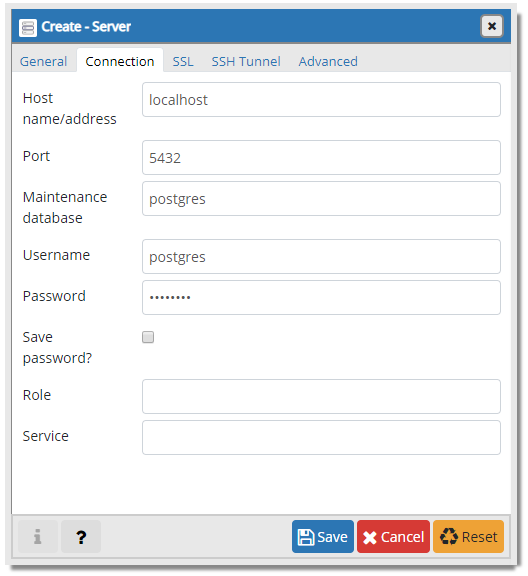
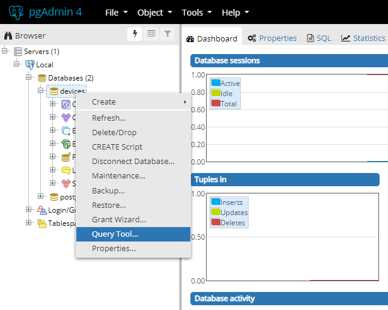
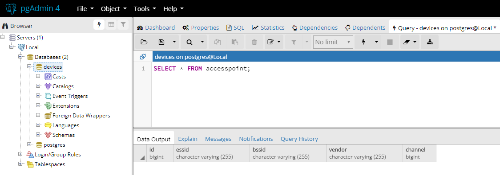
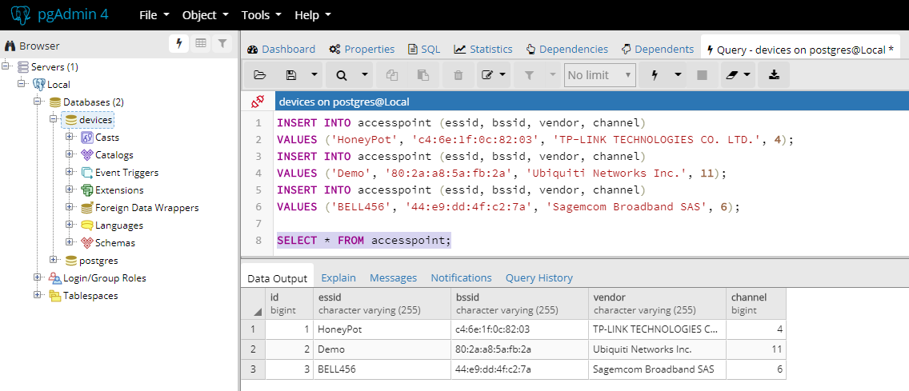

# Database Primer

This project serves as an introduction to interacting with a database in an enterprise environment. As such, we use tools such as Maven and Liquibase.

## Getting Started

These instructions will get you up and running on your local PC. Sometimes we take our tool chains for granted but once in place they allow us to be quite productive. In this project we introduce a handful of tools that professional developers keep in their "tool kit."

### Prerequisites

Since this is about Structured Query Language (SQL), one of the first things we will need access to is a database. In the "old" days we would have to either install a developer edition of a database server or convince a Database Administrator to let us use one of theirs! With the advent of containerization, we can bring a server of our own up almost immediately! All without having to install a bunch of dependencies on our PC.

#### Docker

In this case, we are using Docker and a [PostgreSQL image](https://hub.docker.com/_/postgres?tab=description). Docker is fairly easy to install but for more guidance we have provided information in the [Docker section](https://github.com/gkhays/db-primer/wiki/Docker-for-Windows) of the [wiki](https://github.com/gkhays/db-primer/wiki). So be sure to check it out.

We prefer `docker-compose` because it is suitable for orchestration and reduces the number of parameters and options at invocation time. Using it, bring up an instance of PostgreSQL.

```bash
docker-compose up -d db
```

For the curious, a recipe is located in the `docker-compose.yml` file, located in the root of this project.

**Optional**: For those desiring more control, the same outcome can be achieved by using Docker directly.

```bash
docker pull postgres:10.5-alpine
docker run -d -p 5432:5432 postgres:10.5-alpine
```

#### Java

The project requires a Java JDK so that Maven may function correctly. We recommend the [Zulu Community OpenJDK](https://www.azul.com/downloads/zulu-community/?&architecture=x86-64-bit&package=jdk) Java 8 (LTS) version.

#### Maven

Maven is an imperative build and dependency management tool that enforces a certain structure on Java software projects. It is favored by enterprise software development in order to facilitate repeatable, predictable builds. It also features a rich ecosystem of plugins, several of which we employ in this project. Detailed instruction for installing it are under the [Maven section](https://github.com/gkhays/db-primer/wiki/Maven) in the [wiki](https://github.com/gkhays/db-primer/wiki).

### Installing

Clone this repository.

```bash
git clone https://github.com/gkhays/db-primer
cd db-primer
```

Then install the database. This is done using the following Maven invocation from a command line prompt.

```bash
mvn clean install -Ddb.create
```

If the database already exists it will be dropped. Then the tables are generated using [Liquibase](https://www.liquibase.org/) changesets. The changesets themselves are defined in [src/main/resources/changelog.xml](https://github.com/gkhays/db-primer/blob/master/src/main/resources/changelog.xml) in the resources section of the source code.

You can learn more about the Maven settings by looking through the `pom.xml` file in the root of this project.

### Testing

Programmatic database access is accomplished through [Hibernate](https://hibernate.org/). A couple of tests have been created to demonstrate connectivity and interaction. Execute the test cases with Maven `test`.

```bash
mvn test
```

When writing new code, use `EntityManager`. If working on existing code, you may encounter the Hibernate `Session` object. Both approaches are encapsulated.

## Interacting with the Database

There are many ways to interact with a database in the capacity of an administrator or user. We will briefly explore the pgAdmin 4 graphical user interface.

### pgAdmin 4

Bring up a containerized instance of `pgAdmin 4`.

```bash
docker-compose up -d pgadmin
```

**Optional**: Invoke from `docker run`.

```bash
docker pull thajeztah/pgadmin4
docker run --rm -d -p 5050:5050 --name pgadmin thajeztah/pgadmin4
```

Then navigate to http://localhost:5050 in your browser.

To connect to the database, use the left hand browser panel. Right or context mouse click on Servers >> Create >> Server and give your server a name such as "Local." Switch to the Connection tab and enter the connection information as follows.



**Note**: Depending on your network configuration you may have to enter your IP address.

Now use the query tool by expanding your server by clicking on the `+` symbol (to the left of `Local` (if that is what you named your server). Further expand Databases and choose `devices`. Now right mouse click and choose `Query Tool...`.



#### Select Query

The first thing we will want to do is survey the `accesspoint` table by executing a `SELECT` query.

```sql
SELECT * FROM accesspoint;
```

Then click on `F5` or the little lightning bolt or `Execute/Refresh` button. If this is the first time, there will be no rows but the query tool will display the column headings.



#### Insert Query

Insert data into the `accesspoint` table. In the same window we used previously, replace the `SELECT` query with the following `INSERT` statments (all three). Again hit `F5` or the `Execute/Refresh` button.

```sql
INSERT INTO accesspoint (essid, bssid, vendor, channel)
VALUES ('HoneyPot', 'c4:6e:1f:0c:82:03', 'TP-LINK TECHNOLOGIES CO. LTD.', 4);

INSERT INTO accesspoint (essid, bssid, vendor, channel)
VALUES ('Demo', '80:2a:a8:5a:fb:2a', 'Ubiquiti Networks Inc.', 11);

INSERT INTO accesspoint (essid, bssid, vendor, channel)
VALUES ('BELL456', '44:e9:dd:4f:c2:7a', 'Sagemcom Broadband SAS', 6);
```

PgAdmin will inform you if it successfully inserted the rows or display an error message otherwise.

Display all the rows in the table. To view the results, we will use a little trick. Under the last insert statement, start a new line and retype the select query.

```sql
SELECT * FROM accesspoint;
```

Now using your mouse, highlight only the select statement and click `F5` or the `Execute/Refresh` button. This will only execute the select query while leaving the previous statement intact in the work area.



Be sure to continue exploring to become more familiar with the database and features of `pgAdmin`. For more information on SQL see the [corresponding section](https://github.com/gkhays/db-primer/wiki/SQL-Mini-Tutorial) in the [wiki](https://github.com/gkhays/db-primer/wiki).

See also the [Command-line section](https://github.com/gkhays/db-primer/wiki/Universal-Command-Line-Interface-for-SQL-Databases) of the [wiki](https://github.com/gkhays/db-primer/wiki) for a brief description of the `usql SQL` command-line utility.

## Built With

* [Maven](https://maven.apache.org/) - Dependency management
* [Liquibase](https://www.liquibase.org/) - Database schema change management
